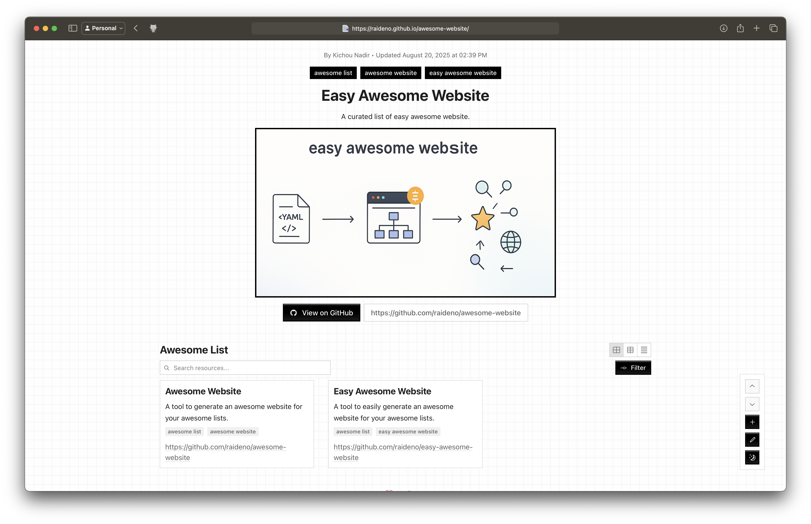

# Awesome Website

This repository contains the source code for "Awesome Website", a project that transforms a simple YAML file into a beautiful, interactive, and easily deployable website. It's the perfect solution for creating and maintaining "awesome lists" with a polished and professional look.

**[Demo:](https://raideno.github.io/awesome-website/)** [https://raideno.github.io/awesome-website](https://raideno.github.io/awesome-website/)



# TODOs

- [ ] Have a README version of the list automatically generated as well.
- [ ] Auto generate contributors list.

## Getting Started

To create your own awesome list website, you'll need to fork this repository and modify the `example.list.yaml` file.

### Usage

```yaml
name: Deploy Awesome Website to GitHub Pages

on:
  push:
    branches: [main]
  workflow_dispatch:

jobs:
  build-and-deploy:
    runs-on: ubuntu-latest
    permissions:
      contents: read
      pages: write
      id-token: write
    steps:
      - name: checkout repository
        uses: actions/checkout@v4

      - name: build awesome website
        uses: raideno/awesome-website@main
        with:
          # Formatted according to the structure specified below
          yaml-path: 'example.list.yaml'

      - name: upload build artifact
        uses: actions/upload-pages-artifact@v3
        with:
          path: awesome-website-src/dist
          name: github-pages

      - name: deploy to github pages
        id: deployment
        uses: actions/deploy-pages@v4
        with:
          artifact_name: github-pages

```

1. **Create a GitHub repository.**
2. **Create List File:** Copy [`example.list.yaml`](./example.list.yaml) into your repository.
3. **Customize your list:** Edit the `example.list.yaml` file to add your own title, description, and list of resources. See the [YAML File Structure](#yaml-file-structure) section below for a detailed explanation of the available fields.
4. **Enable GitHub Pages:** In your repository's settings, go to the "Pages" section and select "GitHub Actions" as the source. This will trigger the deployment workflow.
5. **Create Workflow file:** Copy [.github/workflows/deploy-awesome-website.yml](./.github/workflows/deploy-awesome-website.yml) into your repository.
6. **Finally:** Push your changes and wait for the github action to complete in order to see your changes.

Your new awesome list website will be available at `https://<your-username>.github.io/<your-repository-name>/`.

## YAML File Structure

The `example.list.yaml` file has a clear structure that's easy to understand and modify. Below is a breakdown of each section and its purpose.

| Field          | Type                    | Description                                                             |
| :------------- | :---------------------- | :---------------------------------------------------------------------- |
| `mode`         | `detailed` or `minimal` | Defines the display mode for the resource cards.                        |
| `title`        | String                  | The main title of your awesome list.                                    |
| `description`  | String                  | A short description of your list that will appear in the header.        |
| `version`      | String                  | The version number of your list.                                        |
| `tags`         | Array of Strings        | A list of global tags that describe the entire collection.              |
| `author`       | String                  | The name of the primary author of the list.                             |
| `contributors` | Array of Strings        | A list of people who have contributed to the list.                      |
| `date`         | String                  | The publication date of the list.                                       |
| `last_updated` | String                  | The date when the list was last updated.                                |
| `repository`   | URL                     | The URL of the GitHub repository for the list.                          |
| `website`      | URL                     | An optional URL for a dedicated website for the list.                   |
| `thumbnail`    | URL                     | An optional URL for a thumbnail image to be displayed in the header.    |
| `links`        | Array of Objects        | A list of additional links to be displayed in the header.               |
| `categories`   | Array of Objects        | A list of categories to organize your resources.                        |
| `elements`     | Array of Objects        | The core of your awesome list, where each object represents a resource. |

### Link Object Structure

| Field   | Type   | Description                    |
| :------ | :----- | :----------------------------- |
| `label` | String | The display text for the link. |
| `url`   | URL    | The URL the link points to.    |

### Category Object Structure

| Field  | Type   | Description                                         |
| :----- | :----- | :-------------------------------------------------- |
| `name` | String | The full name of the category.                      |
| `slug` | String | A unique, URL-friendly identifier for the category. |
| `icon` | String | An emoji or icon to represent the category.         |

### Element Object Structure

| Field         | Type                  | Description                                                                      |
| :------------ | :-------------------- | :------------------------------------------------------------------------------- |
| `name`        | String                | The name of the resource.                                                        |
| `description` | String                | A short description of the resource.                                             |
| `content`     | String                | A more detailed description or additional information about the resource.        |
| `urls`        | Array of Link Objects | A list of relevant URLs for the resource (e.g., website, GitHub, documentation). |
| `thumbnail`   | URL                   | An optional URL for a thumbnail image for the resource.                          |
| `category`    | String                | The slug of the category this resource belongs to.                               |
| `stars`       | Number                | The number of stars on GitHub (optional).                                        |
| `tags`        | Array of Strings      | A list of tags specific to this resource for filtering.                          |

## Deployment

This project includes a GitHub Actions workflow that automatically builds and deploys your website to GitHub Pages. The workflow is triggered every time you push a change to the `main` branch.

To enable automated deployments, make sure to configure GitHub Pages to use the "GitHub Actions" source in your repository's settings.

## Development

- Development: `LIST_FILE_PATH=./example.list.yaml npm run dev`
- Build: `LIST_FILE_PATH=./example.list.yaml npm run build`
- Start Build: `LIST_FILE_PATH=./example.list.yaml npm run start`